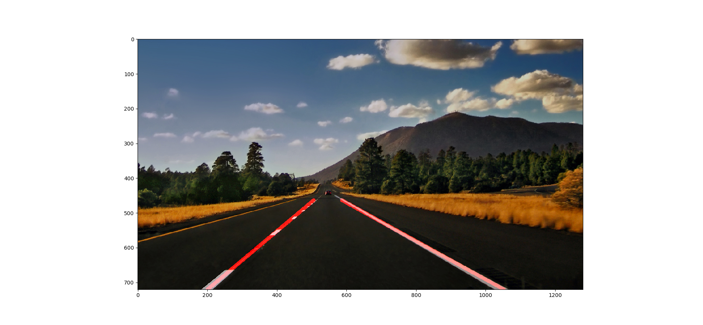

**Finding Lane Lines on the Road**

The first skill that a self-driving car must have is the ability to detect lanes. In this project it is shown how to perform lane detection by using OpenCV with Python. For now, we'll only focus on straight lanes. In a next project, curvature will be introduced.

**Step 1:** Getting setup with Python

For this project, you will need Python 3.5 along with the numpy, matplotlib, and OpenCV libraries.

It is reccomended to install the Anaconda Python 3 distribution from Continuum Analytics.

Choose the appropriate Python 3 Anaconda install package for your operating system <A HREF="https://www.continuum.io/downloads" target="_blank">here</A>.   Download and install the package.

If you already have Anaconda for Python 2 installed, you can create a separate environment for Python 3 and all the appropriate dependencies with the following command:

`>  conda create --name=yourNewEnvironment python=3.5 anaconda`

`>  source activate yourNewEnvironment`

**Step 2:** Installing OpenCV

Once you have Anaconda installed, first double check you are in your Python 3 environment:

`>python`
`Python 3.5.2 |Anaconda 4.1.1 (x86_64)| (default, Jul  2 2016, 17:52:12)`
`[GCC 4.2.1 Compatible Apple LLVM 4.2 (clang-425.0.28)] on darwin`
`Type "help", "copyright", "credits" or "license" for more information.`
`>>>`
(Ctrl-d to exit Python)

run the following command at the terminal prompt to get OpenCV:

`>  conda install -c https://conda.anaconda.org/menpo opencv3`

then to test if OpenCV is installed correctly:

`> python`
`>>> import cv2`
`>>>`
(Ctrl-d to exit Python)

**Step 3:** Installing moviepy

The "moviepy" package processes videos in this project (different libraries might be used as well).

To install moviepy run:

`>pip install moviepy`

and check that the install worked:

`>python`
`>>>import moviepy`
`>>>`
(Ctrl-d to exit Python)

**Step 4:** Run

Run `processImage.py` in order to detect the lane on a single image.
Run `processVideo.py` in order to detect the lane on a video.
